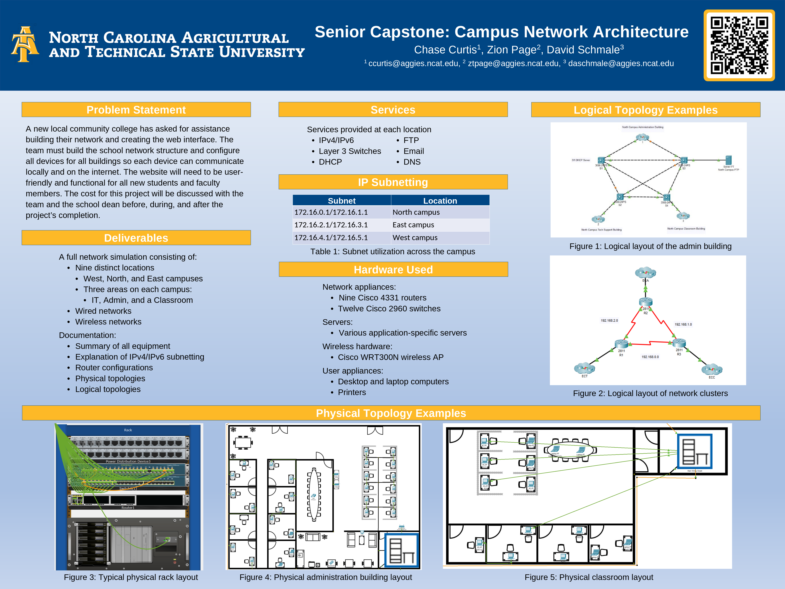
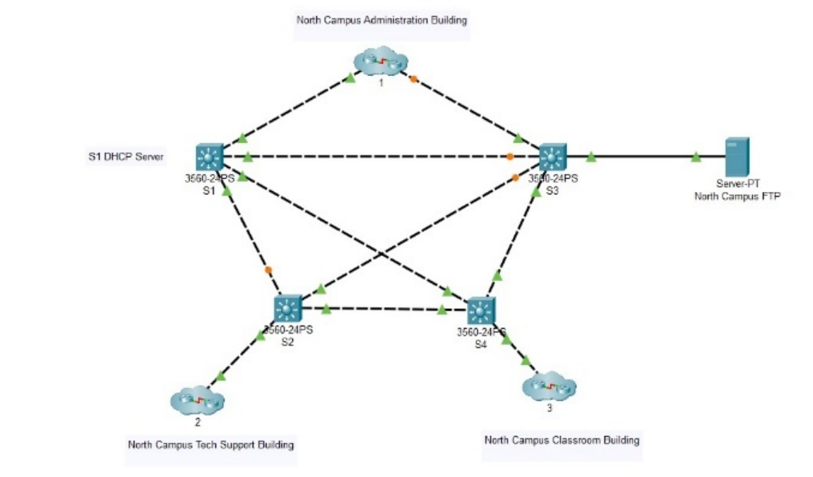
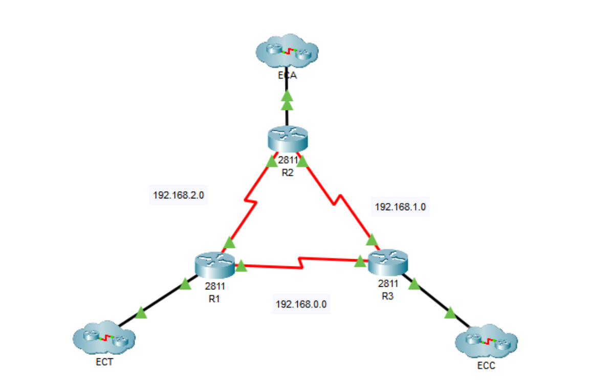
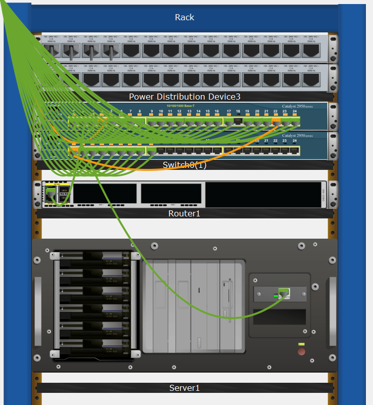
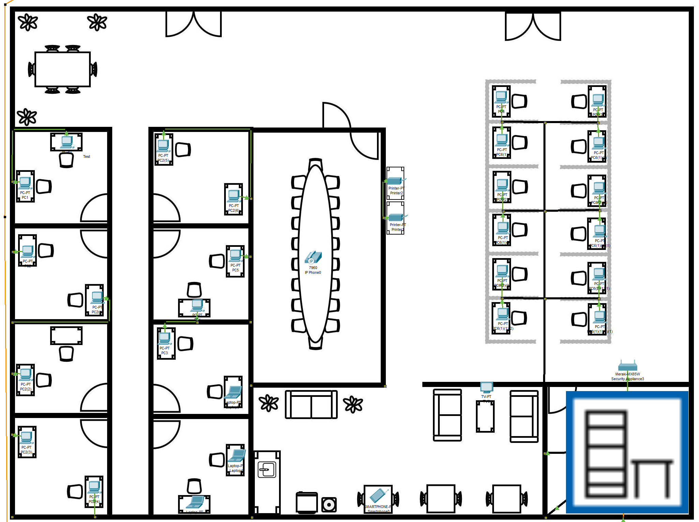
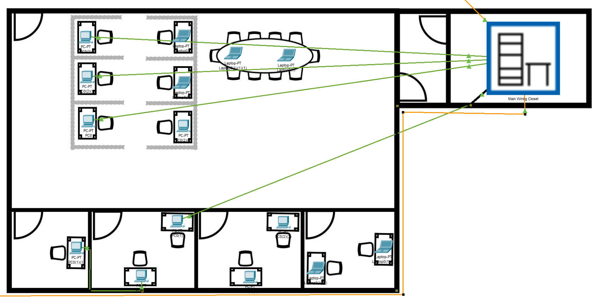

# Senior Capstone: Campus Network Architecture

## Problem Statement

A new local community college has asked for assistance building their network and creating the web interface. The team must build the school network structure and configure all devices for all buildings so each device can communicate locally and on the internet. The website will need to be user-friendly and functional for all new students and faculty members. The cost for this project will be discussed with the team and the school dean before, during, and after the project’s completion.

### Poster

## Deliverables

A full network simulation consisting of:

* Nine distinct locations
  * West, North, and East campuses
  * Three areas on each campus:
    * IT, Admin, and a Classroom
* Wired networks
* Wireless networks

Documentation:

* Summary of all equipment
* Explanation of IPv4/IPv6 subnetting
* Router configurations
* Physical topologies
* Logical topologies

## Services

Services provided at each location:

* IPv4/IPv6
* Layer 3 Switches
* DHCP
* FTP
* Email
* DNS

## IP Subnetting

Subnet utilization across the campus

Subnet | Location
---|---
172.16.0.1/172.16.1.1|North campus
172.16.2.1/172.16.3.1|East campus
172.16.4.1/172.16.5.1|West campus

## Hardware Used

Network appliances:
Nine Cisco 4331 routers
Twelve Cisco 2960 switches
Servers:
Various application-specific servers
Wireless hardware:
Cisco WRT300N wireless AP
User appliances:
Desktop and laptop computers
Printers

## Logical Topology Examples

### Logical layout of the admin building

### Logical layout of network clusters

## Physical Topology Examples

### Typical physical rack layout

### Physical administration building layout

### Physical classroom layout

